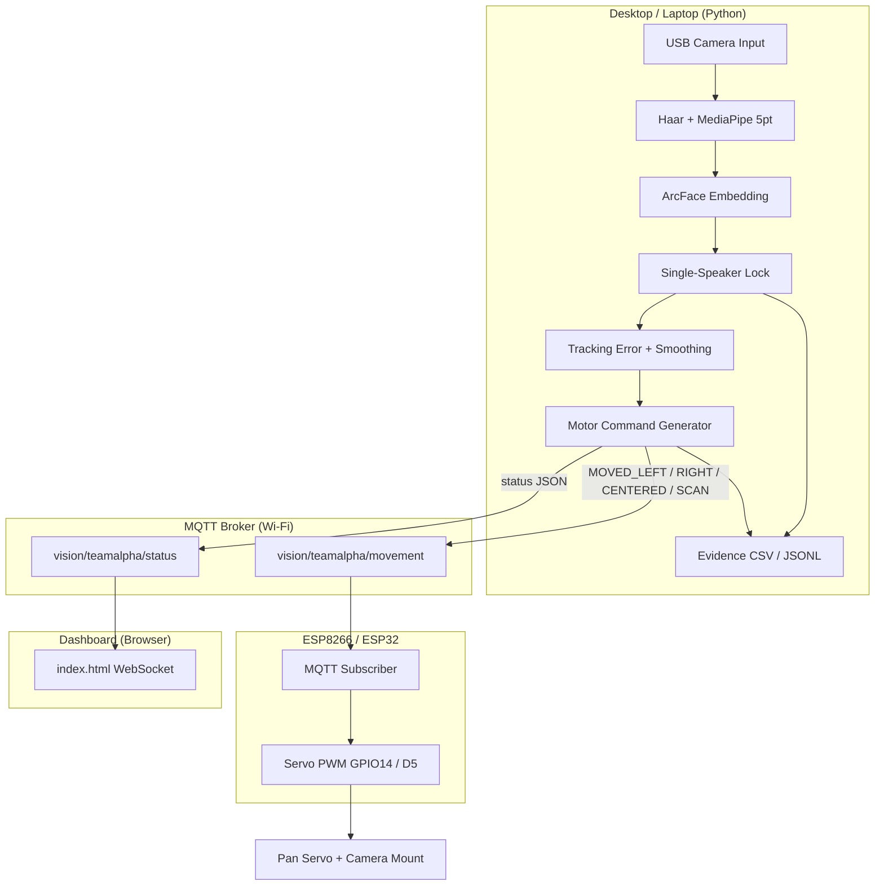
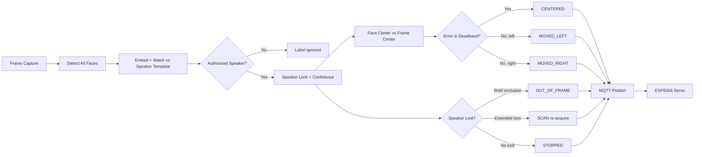

# BENAX AI-Powered Single-Speaker Face Recognition and Camera Tracking System

**BENAX Technologies Ltd** — integrated assessment project combining machine learning, computer vision, MQTT networking, ESP8266/ESP32 embedded control, and servo motor actuation.

The PC runs face enrollment, **single-identity speaker recognition**, face tracking, and motor-command generation. An ESP8266 (or ESP32) subscribes over Wi-Fi via MQTT and drives a horizontal pan servo to keep the enrolled speaker centered. A USB camera (e.g. FalconEye V1 HD) on a 2-DOF mount provides the video feed.

## System Overview



## Recognize → Track → Command Pipeline



Full integrated-system documentation (hardware platform, pipeline flowcharts, validation checklist, evidence format):

**[docs/BENAX_INTEGRATED_SYSTEM.md](docs/BENAX_INTEGRATED_SYSTEM.md)** · **[docs/ASSESSMENT_TEST_GUIDE.md](docs/ASSESSMENT_TEST_GUIDE.md)** (demo script for assessors)

Validate installation and policy logic:

```bash
python addons/mqtt_servo_tracking/validate_system.py
```

## Project Layout

| Path | Role |
|------|------|
| `src/enroll.py` | Speaker enrollment (10–30 images → embedding template) |
| `src/recognize.py` | Local recognition + face locking (no MQTT) |
| `src/speaker_protocol.py` | BENAX motor commands + evidence logging |
| `src/speaker_recognition.py` | Single-speaker policy — identify only enrolled speaker |
| `docs/BENAX_INTEGRATED_SYSTEM.md` | Platform diagram, pipeline, validation, safety |
| `docs/ASSESSMENT_TEST_GUIDE.md` | Step-by-step assessment demonstration & pass criteria |
| `addons/mqtt_servo_tracking/validate_system.py` | Automated validation report |
| `src/rebuild_db.py` | Rebuild `data/db/face_db.npz` from crops |
| `addons/mqtt_servo_tracking/recognize_mqtt.py` | **Main integrated system** — speaker lock + MQTT + evidence |
| `addons/mqtt_servo_tracking/esp8266/` | ESP8266 servo firmware (D5 / GPIO14) |
| `addons/mqtt_servo_tracking/esp32/` | ESP32 servo firmware (GPIO13) |
| `dashboard/index.html` | Live MQTT dashboard (WebSocket) |
| `logs/evidence/` | Assessment evidence CSV + JSONL |
| `logs/` | Session action history |

## Requirements

Python 3.10+ (3.10–3.13 recommended). Install from repo root:

```bash
python -m venv venv
venv\Scripts\activate        # Windows
pip install -r requirements.txt
```

Model files (place in `models/`):

- `models/embedder_arcface.onnx`
- `models/face_landmarker.task`

## Quick Start (Assessment Workflow)

### 1. Speaker enrollment

Capture **10–30** facial images of the main speaker:

```bash
python -m src.enroll
```

Controls: `SPACE` capture · `a` auto-capture · `s` save · `q` quit

Stores template in `data/db/face_db.npz` and crops in `data/enroll/<speaker>/`.

### 2. Run integrated tracking + MQTT

```bash
python addons/mqtt_servo_tracking/recognize_mqtt.py --cpu-only --camera-index 0 --speaker-name Demo
```

If only one person is enrolled, `--speaker-name` can be omitted.

| Flag | Purpose |
|------|---------|
| `--speaker-name NAME` | Authorized speaker (single-identity mode) |
| `--auto-lock-speaker` | Auto-lock when speaker detected (default: on) |
| `--no-auto-lock-speaker` | Manual lock with `l` key |
| `--camera-index N` | USB camera index (external pan camera) |
| `--cpu-only` | Skip ONNX provider prompt |
| `--evidence-log` | Write `logs/evidence/session_*.csv` (default: on) |

Controls: `l` lock/unlock · `+`/`-` threshold · `r` reload DB · `q` quit

### 3. Dashboard

Open `dashboard/index.html` in a browser. Default WebSocket: `ws://157.173.101.159:9001`

### 4. ESP8266 firmware

1. Edit Wi-Fi and MQTT in `addons/mqtt_servo_tracking/esp8266/face_tracker_servo/face_tracker_servo.ino`
2. Wire servo signal → **D5 (GPIO14)**; use external 5V for servo power
3. Upload:

```powershell
powershell -ExecutionPolicy Bypass -File addons/mqtt_servo_tracking/esp8266/upload.ps1 -Port COM5
```

## BENAX Motor Commands (MQTT)

Published on `vision/teamalpha/movement`:

| Command | Meaning |
|---------|---------|
| `MOVED_LEFT` | Speaker left of center — pan left |
| `MOVED_RIGHT` | Speaker right of center — pan right |
| `CENTERED` | Speaker centered in frame |
| `STOPPED` | No active speaker lock |
| `OUT_OF_FRAME` | Speaker temporarily occluded |
| `SCAN` | Re-acquisition sweep after extended loss |

Legacy names (`LEFT`, `RIGHT`, `CENTER`, `SEARCH`, `IDLE`) are still accepted by firmware.

## Evidence Logging

Each session writes to `logs/evidence/`:

- `session_YYYYMMDD_HHMMSS.csv`
- `session_YYYYMMDD_HHMMSS.jsonl`

Fields: timestamp, speaker ID, confidence, similarity, distance, motor command, error_x, locked, speaker_visible, faces_in_frame, FPS.

## System Features (Assessment Mapping)

| Requirement | Implementation |
|-------------|----------------|
| Face enrollment (10–30 samples) | `src/enroll.py` |
| Single-identity speaker lock | `recognize_mqtt.py --speaker-name` ignores other faces |
| Tracking + motor commands | Horizontal error → BENAX commands with deadband + hysteresis |
| MQTT PC → ESP | `paho-mqtt` publisher + ESP8266 subscriber |
| Servo pan control | ESP8266 GPIO14 / ESP32 GPIO13 |
| Occlusion / re-acquisition | `OUT_OF_FRAME` → `SCAN` |
| Evidence logging | CSV + JSONL under `logs/evidence/` |
| Multi-face robustness | Non-speaker faces labeled **Ignored** |

## Hardware Notes

- **Vision:** USB camera on 2-DOF mount (manual tilt; servo provides horizontal pan)
- **Control:** ESP8266 MQTT subscriber → servo PWM
- **Power:** Power ESP from USB; use dedicated 5V for servo (shared GND)
- **Computing:** PC runs Python AI pipeline + MQTT client

## Troubleshooting

- Empty database → run `python -m src.enroll`
- Camera not found → try `--camera-index 0`, `1`, or `2`
- Dashboard offline → broker must expose WebSockets on port 9001
- ESP not moving → check Serial Monitor, Wi-Fi, MQTT topic, servo wiring
- Multiple enrolled faces → always pass `--speaker-name`
