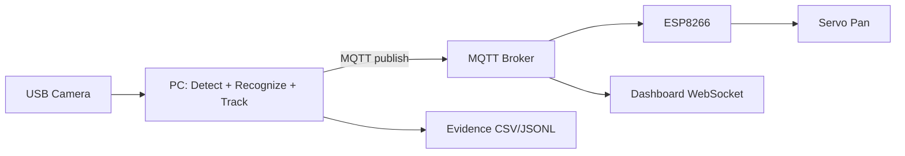

# BENAX FaithLock — Assessment Demonstration Test Guide

Use this guide to demonstrate to assessors that every integrated-system requirement is implemented and working. Each test maps to a **task activity**, **feature**, or **validation scenario** from the BENAX brief.

Related documentation: [BENAX_INTEGRATED_SYSTEM.md](BENAX_INTEGRATED_SYSTEM.md)

---

## 0. Pre-demonstration checklist

| Item | Check | How to verify |
|------|--------|----------------|
| Python venv active | ☐ | `.\venv\Scripts\Activate.ps1` |
| Models present | ☐ | `models/embedder_arcface.onnx`, `models/face_landmarker.task` |
| Speaker enrolled | ☐ | `data/db/face_db.npz` exists; identity **Faith** (or your speaker name) |
| Enrollment crops | ☐ | `data/enroll/Faith/*.jpg` (8–30 images) |
| Pan USB camera | ☐ | Index **1**, rotate **180** (`python scripts/probe_cameras.py` if unsure) |
| ESP8266 flashed | ☐ | `face_tracker_servo.ino` — topic `vision/faithlock/movement`, D5/GPIO14 |
| ESP8266 on Wi‑Fi | ☐ | Serial: `[WiFi] Connected, IP=...` then `[MQTT] Connected` |
| MQTT broker reachable | ☐ | `python scripts/diagnose_mqtt.py` → TCP + MQTT OK |
| Dashboard | ☐ | `http://localhost:8765/index.html` (not `file://`) |
| Automated validation | ☐ | `python addons/mqtt_servo_tracking/validate_system.py` → all PASS |

**Evidence to show before live demo:** latest `logs/evidence/validation_report_*.json` and enrollment folder.

---

## 1. System architecture (integrated situation)

**What to show:** PC (AI) → MQTT (Wi‑Fi) → ESP8266 → servo → camera mount.

| Layer | Component | Demonstration |
|-------|-----------|---------------|
| Vision | USB pan camera | External cam on servo mount |
| Computing | Laptop running Python | `recognize_mqtt.py` window + terminal |
| Networking | MQTT broker `157.173.101.159:1883` | Dashboard “Live”; ESP Serial “Connected” |
| Embedded | ESP8266 subscriber | Serial shows `[MQTT] Received: MOVED_LEFT` etc. |
| Actuation | Servo on D5 (GPIO14) | Camera pans when speaker moves |
| Monitoring | Dashboard + logs | FaithLock UI + `logs/evidence/session_*.csv` |

### Recognize → Track → Command pipeline

```text
┌─────────────┐    ┌──────────────┐    ┌─────────────────┐    ┌──────────────────┐
│ USB Camera  │───▶│ Face Detect  │───▶│ Embed + Match   │───▶│ Speaker Policy   │
│ Frame Input │    │ Haar+FaceMesh│    │ vs Enrolled Tmpl│    │ Only 1 ID kept   │
└─────────────┘    └──────────────┘    └─────────────────┘    └────────┬─────────┘
                                                                        │
                     ┌──────────────────────────────────────────────────┘
                     ▼
              ┌──────────────┐    ┌─────────────────┐    ┌─────────────────┐
              │ Speaker Lock │───▶│ Horizontal Error │───▶│ Deadband + EMA  │
              │ + Confidence │    │ face_x - center  │    │ + Hysteresis    │
              └──────────────┘    └─────────────────┘    └────────┬────────┘
                                                                   │
                     ┌─────────────────────────────────────────────┘
                     ▼
    ┌────────────────────────────────────────────────────────────────────────┐
    │ Motor Command                                                          │
    │  MOVED_LEFT | MOVED_RIGHT | CENTERED | OUT_OF_FRAME | SCAN | STOPPED   │
    └───────────────────────────────┬────────────────────────────────────────┘
                                    │
              ┌─────────────────────┼─────────────────────┐
              ▼                     ▼                     ▼
       ┌────────────┐        ┌────────────┐        ┌────────────┐
       │ MQTT 1883  │        │ Evidence   │        │ Dashboard  │
       │ → ESP8266  │        │ CSV/JSONL  │        │ WebSocket  │
       └─────┬──────┘        └────────────┘        └────────────┘
             ▼
       ┌────────────┐
       │ Servo Pan  │
       └────────────┘
```



Full flowchart with decision logic: see [BENAX_INTEGRATED_SYSTEM.md §3](BENAX_INTEGRATED_SYSTEM.md).

---

## 2. Activity A — Speaker face enrollment

**Requirement:** Capture 10–30 images; build one reusable embedding template; store locally.

### Procedure

```powershell
cd FaceLocking-main
.\venv\Scripts\Activate.ps1

# Optional fresh start
python scripts\reset_speaker_db.py

python -m src.enroll --name Faith --camera-index 1 --camera-rotate 180 --fresh
```

1. Only **Faith** in frame (pan camera).
2. Turn head slightly between shots.
3. Press **SPACE** when ready for each photo.
4. Press **S** when **8+** photos saved (12+ recommended).

### Pass criteria

| Criterion | Evidence |
|-----------|----------|
| 8–30 aligned crops saved | `data/enroll/Faith/*.jpg` |
| Single template in DB | `data/db/face_db.npz` + `face_db.json` |
| One identity only | `face_db.json` → `"names": ["Faith"]` |

**Say to assessor:** *Enrollment uses Haar detection → 5-point landmarks → ArcFace embedding → mean template stored in NPZ.*

**Module:** `src/enroll.py`

---

## 3. Activity B — Single-identity recognition (speaker lock)

**Requirement:** Only enrolled speaker identified; all other faces ignored; confidence shown live.

### Setup

```powershell
# Terminal 1 — dashboard
python -m http.server 8765 --directory dashboard

# Terminal 2 — tracking
python addons\mqtt_servo_tracking\recognize_mqtt.py --cpu-only --camera-index 1 --speaker-name Faith
```

**Default behavior:** auto-lock **OFF** — press **L** to lock manually.

### Test B1 — Authorized speaker recognized

| Step | Action | Expected |
|------|--------|----------|
| 1 | Faith alone in frame | Label **Faith**, confidence % on bounding box |
| 2 | Press **L** | Orange border, “LOCKED”, console: `[SpeakerLock] Locked onto Faith` |
| 3 | Dashboard | Phase: **Tracking** / **Following**; “Locked on Faith” |

### Test B2 — Other faces ignored (critical)

| Step | Action | Expected |
|------|--------|----------|
| 1 | Faith locked; second person enters frame | Second face: **Ignored** or **Unknown**, not Faith |
| 2 | Motor | Pans for **Faith only**, not the other person |
| 3 | Evidence log | `ignored_faces > 0` in `session_*.csv` |

**Optional:** use **A/F** or arrow keys to select face before **L** if multiple faces present.

### Pass criteria

- Only one face drives tracking when locked.
- Others labeled **Ignored** via `src/speaker_recognition.py`.

**Modules:** `src/speaker_recognition.py`, `addons/mqtt_servo_tracking/recognize_mqtt.py`

---

## 4. Activity C — Face tracking and command generation

**Requirement:** Horizontal error → motor commands with smoothing/deadband; continuous MQTT publish.

### Test C1 — Horizontal follow

| Step | Action | Expected |
|------|--------|----------|
| 1 | Locked Faith centered | Command **CENTERED**; dashboard “Holding center” |
| 2 | Faith moves left (appears on camera right) | **MOVED_RIGHT** (camera pans to re-center) |
| 3 | Faith moves right | **MOVED_LEFT** |
| 4 | On-screen overlay | `Motor: MOVED_* (err_x=±NN px)` |
| 5 | ESP Serial | `[MQTT] Received: MOVED_LEFT` / `MOVED_RIGHT` |
| 6 | Servo | Smooth small steps (pulse mode), no violent shaking |

### Test C2 — Smoothing / deadband

**Say to assessor:** *EMA smoothing, pixel deadband, hysteresis, and command-confirm frames reduce jitter.*

Configurable via `--deadzone-px`, `--error-smooth-alpha`, `--command-confirm-frames`.

### Motor commands (BENAX protocol)

| Command | Meaning |
|---------|---------|
| `MOVED_LEFT` | Pan left |
| `MOVED_RIGHT` | Pan right |
| `CENTERED` | In deadband |
| `STOPPED` | No lock / idle |
| `SCAN` | Search sweep (re-acquisition) |
| `OUT_OF_FRAME` | Brief occlusion (logged; not sent to servo) |

### Pass criteria

- CSV shows `motor_command` and `error_x_px` changing as Faith moves.
- Dashboard pan indicator moves left/center/right with commands.

**Module:** `src/speaker_protocol.py`

---

## 5. Activity D — MQTT embedded motor control

**Requirement:** ESP8266 subscribes, interprets commands, drives servo on GPIO14; stable motion.

### Pre-test

```powershell
python scripts\test_servo_mqtt.py --steps 15 --direction right
```

Servo should move without face AI running.

### Test D1 — End-to-end MQTT

| Step | Action | Expected |
|------|--------|----------|
| 1 | Run tracking + ESP powered | ESP: `[MQTT] Connected` |
| 2 | Lock and move Faith | ESP receives `MOVED_LEFT` / `MOVED_RIGHT` |
| 3 | Unlock (**L**) or quit (**q**) | `STOPPED` published |

### Hardware points to mention

| Item | Detail |
|------|--------|
| Signal | D5 → GPIO14 |
| Power | Servo on external 5V; common GND with ESP |
| Safety | Angle limits in firmware; `COMMAND_TIMEOUT_MS` stops motion if MQTT stops |
| Topic | `vision/faithlock/movement` |

### Pass criteria

- Visible pan follows speaker.
- MQTT connects after Wi‑Fi is up (re-flash firmware if `rc=-2` persists).

**Modules:** `addons/mqtt_servo_tracking/esp8266/face_tracker_servo/face_tracker_servo.ino`, `scripts/test_servo_mqtt.py`

---

## 6. Activity E — Robustness and re-acquisition

**Requirement:** Temporary occlusion → controlled search → same speaker re-locked.

**Default:** search on lost enabled (`--allow-scan`); SCAN after brief confirm + ~1 s delay.

### Test E1 — Brief occlusion

| Step | Action | Expected |
|------|--------|----------|
| 1 | Faith locked and tracked | `CENTERED` or `MOVED_*` |
| 2 | Hand briefly covers face | May hold last pan; lock **stays** |
| 3 | Face visible again | Tracking resumes; same speaker **Faith** |

### Test E2 — Extended loss (search mode)

| Step | Action | Expected |
|------|--------|----------|
| 1 | Faith locked | Tracking active |
| 2 | Faith leaves frame completely | After short delay: **SCAN** |
| 3 | Tracking window | `[SEARCH] Sweeping for Faith` |
| 4 | Dashboard | Phase: **Searching**; servo sweeps |
| 5 | Faith returns to frame | Auto re-acquire; tracking resumes |
| 6 | Console | Lock **not** dropped during search |

### Pass criteria

- `session_*.csv` contains `motor_command=SCAN` and `event_note` with `reacquire_scan`.
- After return: `speaker_visible=true`, `speaker_id=Faith`, tracking commands resume.

---

## 7. Activity F — System validation and evidence logging

**Requirement:** Log speaker ID, confidence, timestamps, motor commands; demonstrate realistic scenarios.

### Automated validation (run first)

```powershell
python addons\mqtt_servo_tracking\validate_system.py
```

Show assessor: all checks **PASS** and `logs/evidence/validation_report_*.json`.

### Live session evidence

Each tracking run creates:

| File | Purpose |
|------|---------|
| `logs/evidence/session_YYYYMMDD_HHMMSS.csv` | Spreadsheet for assessors |
| `logs/evidence/session_YYYYMMDD_HHMMSS.jsonl` | Machine-readable audit |

**CSV columns:** `timestamp_iso`, `speaker_id`, `confidence`, `similarity`, `distance`, `motor_command`, `error_x_px`, `locked`, `speaker_visible`, `faces_in_frame`, `ignored_faces`, `fps`, `event_note`

### Scenario matrix

| # | Scenario | What you do | Pass criteria | Evidence field |
|---|----------|-------------|---------------|----------------|
| 1 | **Multiple faces** | Faith + assistant in frame | Only Faith tracked; others Ignored | `ignored_faces > 0` |
| 2 | **Occlusion** | Brief hand over face | Brief hold; no wrong lock | `event_note` / visibility flags |
| 3 | **Extended loss** | Walk out of frame | SCAN sweep | `motor_command=SCAN` |
| 4 | **Re-acquisition** | Walk back in | Same ID Faith re-tracked | `speaker_id=Faith`, `locked=true` |
| 5 | **Horizontal motion** | Walk left/right | LEFT/RIGHT/CENTERED + error | `error_x_px` varies |
| 6 | **Safe idle** | Press **L** unlock or **q** quit | Servo stops | `STOPPED`, `locked=false` |

**Module:** `src/speaker_protocol.py` (`EvidenceLogger`)

---

## 8. Suggested 15-minute demonstration script

| Time | Segment | What to show |
|------|---------|--------------|
| 0–2 min | **Setup** | Architecture diagram; `validate_system.py` PASS; enrollment files |
| 2–4 min | **Enrollment** | Open `data/enroll/Faith/` crops; explain template in `face_db.npz` |
| 4–5 min | **MQTT + hardware** | `test_servo_mqtt.py` or ESP Serial; servo moves |
| 5–7 min | **Lock + single ID** | Faith alone → **L** lock; confidence on screen |
| 7–9 min | **Multi-face** | Second person enters → **Ignored**; camera still follows Faith |
| 9–11 min | **Tracking** | Faith walks left/right; dashboard + ESP commands |
| 11–13 min | **Re-acquisition** | Faith leaves → SCAN; returns → re-track |
| 13–15 min | **Evidence** | Open latest `session_*.csv`; highlight columns; dashboard UI |

---

## 9. Quick command reference

```powershell
# Activate environment
.\venv\Scripts\Activate.ps1

# Enroll
python -m src.enroll --name Faith --camera-index 1 --camera-rotate 180 --fresh

# Validate software
python addons\mqtt_servo_tracking\validate_system.py

# Diagnose MQTT
python scripts\diagnose_mqtt.py

# Servo smoke test (no AI)
python scripts\test_servo_mqtt.py --steps 15

# Dashboard
python -m http.server 8765 --directory dashboard

# Full integrated system
python addons\mqtt_servo_tracking\recognize_mqtt.py --cpu-only --camera-index 1 --speaker-name Faith
```

**Tracker controls:** `L` lock/unlock · `A`/`F` or arrows select face · `q` quit · `+`/`-` threshold · `r` reload DB

---

## 10. Brief requirements → implementation map

| Brief requirement | Implementation |
|-------------------|----------------|
| 10–30 enrollment images | `src/enroll.py` — SPACE/S save, crops in `data/enroll/` |
| Single speaker template | Mean ArcFace embedding in `face_db.npz` |
| Ignore other faces | `src/speaker_recognition.py` → **Ignored** |
| Speaker lock | Manual **L** (default); optional `--auto-lock-speaker` |
| Tracking error → commands | `command_from_error_with_hysteresis()` in `speaker_protocol.py` |
| Smoothing / deadband | EMA, deadzone, hysteresis, confirm frames |
| MQTT publish/subscribe | `recognize_mqtt.py` + ESP `.ino` |
| Servo GPIO14 / D5 | `SERVO_PIN = 14` in firmware |
| Occlusion + SCAN | `command_when_speaker_lost()` + `--allow-scan` (default ON) |
| Evidence logging | `EvidenceLogger` → `logs/evidence/session_*` |
| Live monitoring | `dashboard/index.html` |
| Flowchart | `docs/BENAX_INTEGRATED_SYSTEM.md` §3 |

---

## 11. Troubleshooting

| Symptom | Quick fix |
|---------|-----------|
| ESP `rc=-2` | Wait for Wi‑Fi IP; re-flash firmware; run `diagnose_mqtt.py` |
| Servo not moving | Confirm faithlock topic; run `test_servo_mqtt.py` |
| Wrong camera / upside down | `--camera-index 1 --camera-rotate 180` |
| Everyone labeled Faith | Re-enroll alone; stricter threshold with `-` key |
| Dashboard empty | Use `http://localhost:8765`; check WebSocket URL |
| No evidence file | Do not use `--no-evidence-log`; run session ≥30 s |

---

## 12. Safety controls (for assessors)

| Control | Location | Purpose |
|---------|----------|---------|
| Servo angle limits | ESP `SERVO_MIN/MAX_ANGLE` | Mechanical protection |
| MQTT command timeout | ESP `COMMAND_TIMEOUT_MS` | Stop if link drops |
| Pixel deadband + hysteresis | Python `--deadzone-px` | Prevent oscillation |
| Command confirm frames | Python `--command-confirm-frames` | Debounce flicker |
| External 5V for servo | Wiring | Avoid browning out ESP |
| `STOPPED` on session end | Python `finally` block | Safe shutdown |
| Speaker-only policy | `speaker_recognition.py` | Other faces cannot hijack pan |

Automated list also in `validate_system.py` → `safety_controls` in validation report JSON.
