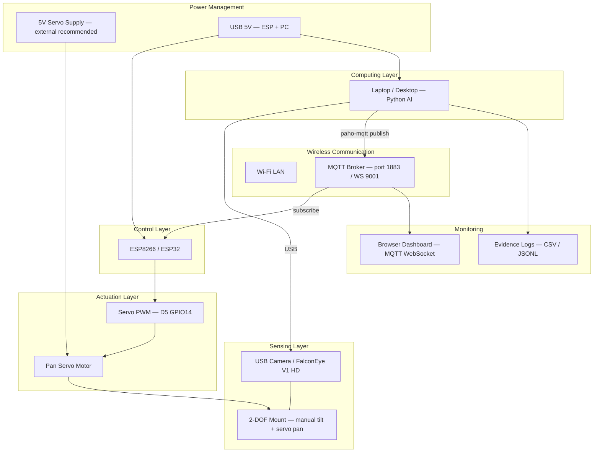
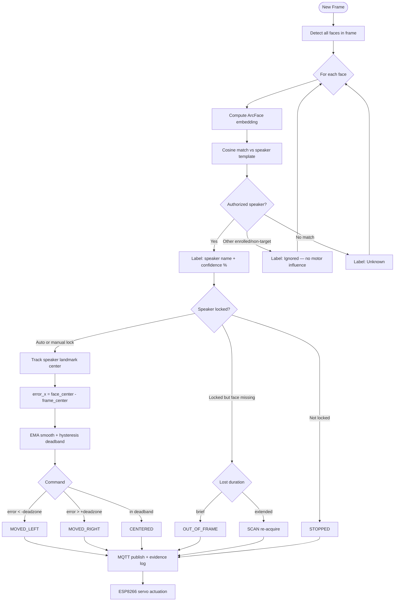

# BENAX Integrated AI–Embedded Vision Tracking Platform

**BENAX Technologies Ltd** — modular, reusable hardware platform for AI-based vision tracking and motorized control, integrating **sensing**, **actuation**, **power management**, and **wireless communication**.

---

## 1. Modular Hardware Platform



| Module | Component | Role |
|--------|-----------|------|
| Sensing | USB camera on pan mount | Face detection input |
| Computing | PC + Python | Enrollment, recognition, tracking, MQTT publish |
| Wireless | Wi-Fi + MQTT | Low-latency command bus PC → ESP → dashboard |
| Control | ESP8266 | Command interpreter, servo PWM |
| Actuation | SG90-class servo | Horizontal camera positioning |
| Power | USB + optional 5V bench | ESP/PC from USB; servo from dedicated 5V |
| Monitoring | Dashboard + evidence logs | Live status + traceable assessment records |

---

## 2. Single-Identity Speaker Recognition

**Policy:** Only the **enrolled authorized speaker** is identified. All other faces are **ignored** and never drive motor commands.

Implementation: `src/speaker_recognition.py` → used by `recognize_mqtt.py`.

| Detected face | Match result | On-screen label | Drives servo? |
|---------------|--------------|-----------------|---------------|
| Enrolled speaker | name + threshold OK | Speaker name + confidence | **Yes** (when locked) |
| Other person | different match | **Ignored** | **No** |
| Unrecognized | below threshold | Unknown | **No** |

```text
classify_face(speaker_name, match) → AUTHORIZED_SPEAKER | IGNORED_OTHER | UNKNOWN
```

---

## 3. Recognize → Track → Command Pipeline

### Block diagram (ASCII)

```text
┌─────────────┐    ┌──────────────┐    ┌─────────────────┐    ┌──────────────────┐
│ USB Camera  │───▶│ Face Detect  │───▶│ Embed + Match   │───▶│ Speaker Policy   │
│ Frame Input │    │ Haar+FaceMesh│    │ vs Enrolled Tmpl│    │ Only 1 ID kept   │
└─────────────┘    └──────────────┘    └─────────────────┘    └────────┬─────────┘
                                                                        │
                     ┌──────────────────────────────────────────────────┘
                     ▼
              ┌──────────────┐    ┌─────────────────┐    ┌─────────────────┐
              │ Speaker Lock │───▶│ Horizontal Error │───▶│ Deadband + EMA  │
              │ + Confidence │    │ face_x - center  │    │ + Hysteresis    │
              └──────────────┘    └─────────────────┘    └────────┬────────┘
                                                                   │
                     ┌─────────────────────────────────────────────┘
                     ▼
    ┌────────────────────────────────────────────────────────────────────────┐
    │ Motor Command                                                          │
    │  MOVED_LEFT | MOVED_RIGHT | CENTERED | OUT_OF_FRAME | SCAN | STOPPED   │
    └───────────────────────────────┬────────────────────────────────────────┘
                                    │
              ┌─────────────────────┼─────────────────────┐
              ▼                     ▼                     ▼
       ┌────────────┐        ┌────────────┐        ┌────────────┐
       │ MQTT 1883  │        │ Evidence   │        │ Dashboard  │
       │ → ESP8266  │        │ CSV/JSONL  │        │ WebSocket  │
       └─────┬──────┘        └────────────┘        └────────────┘
             ▼
       ┌────────────┐
       │ Servo Pan  │
       └────────────┘
```

### Flowchart (decision logic)



---

## 4. Motor Control Commands

| Command | When issued | ESP8266 action |
|---------|-------------|----------------|
| `MOVED_LEFT` | Speaker left of frame center | Step servo left |
| `MOVED_RIGHT` | Speaker right of center | Step servo right |
| `CENTERED` | Speaker in deadband | Center servo |
| `OUT_OF_FRAME` | Locked but briefly occluded | Hold / idle |
| `SCAN` | Extended loss — re-acquisition | Sweep search pattern |
| `STOPPED` | No active speaker lock | Idle |

---

## 5. Safety and Reliability

| Control | Location | Purpose |
|---------|----------|---------|
| Servo angle limits | ESP firmware `SERVO_MIN/MAX_ANGLE` | Mechanical protection |
| MQTT command timeout | ESP `COMMAND_TIMEOUT_MS` | Stop if link drops |
| Pixel deadband + hysteresis | Python `--deadzone-px` | Prevent oscillation |
| Command confirm frames | Python `--command-confirm-frames` | Debounce flicker |
| External 5V for servo | Wiring | Avoid browning out ESP |
| `STOPPED` on session end | Python `finally` block | Safe shutdown |
| Speaker-only policy | `speaker_recognition.py` | Other faces cannot hijack pan |

---

## 6. Evidence Logging (Traceable)

Every tracking session writes to `logs/evidence/`:

| File | Format |
|------|--------|
| `session_YYYYMMDD_HHMMSS.csv` | Spreadsheet evidence |
| `session_YYYYMMDD_HHMMSS.jsonl` | Machine-readable audit trail |
| `validation_report_YYYYMMDD_HHMMSS.json` | Automated system checks |

### CSV columns

`timestamp_iso`, `unix_ts`, `speaker_id`, `confidence`, `similarity`, `distance`, `motor_command`, `error_x_px`, `locked`, `speaker_visible`, `faces_in_frame`, `ignored_faces`, `fps`, `event_note`

### Validation under realistic conditions

| Test | Procedure | Pass criteria |
|------|-----------|---------------|
| **Multiple faces** | Speaker + another person in frame | `ignored_faces > 0`; only speaker tracked |
| **Occlusion** | Hand/object blocks speaker briefly | `OUT_OF_FRAME` in log; re-lock same ID |
| **Extended loss** | Speaker leaves frame > 0.8s | `SCAN` in log; re-acquire when returns |
| **Horizontal tracking** | Speaker walks left/right | `MOVED_LEFT`/`RIGHT`/`CENTERED` + `error_x_px` |
| **Safe idle** | Unlock or quit | `STOPPED`, `locked=false` |

**Step-by-step demonstration script for assessors:** [ASSESSMENT_TEST_GUIDE.md](ASSESSMENT_TEST_GUIDE.md)

Run automated checks:

```bash
python addons/mqtt_servo_tracking/validate_system.py
```

Run live integrated system:

```bash
python scripts/probe_cameras.py   # confirm pan camera index (external USB = usually 1)
python addons/mqtt_servo_tracking/recognize_mqtt.py --cpu-only --camera-index 1 --camera-rotate 180 --speaker-name YourSpeaker
```

---

## 7. Software Module Map

| Assessment activity | Module |
|--------------------|--------|
| Speaker enrollment | `src/enroll.py` |
| Single-identity recognition | `src/speaker_recognition.py` |
| Tracking + commands | `src/speaker_protocol.py` + `recognize_mqtt.py` |
| MQTT motor control | `recognize_mqtt.py` + ESP8266 `.ino` |
| Evidence + validation | `EvidenceLogger` + `validate_system.py` |
| Live monitoring | `dashboard/index.html` |
